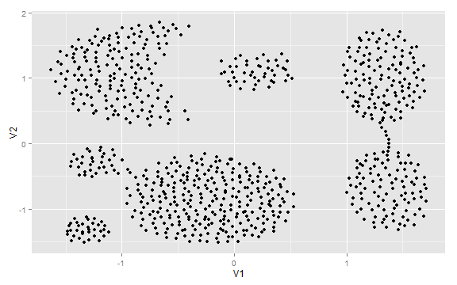
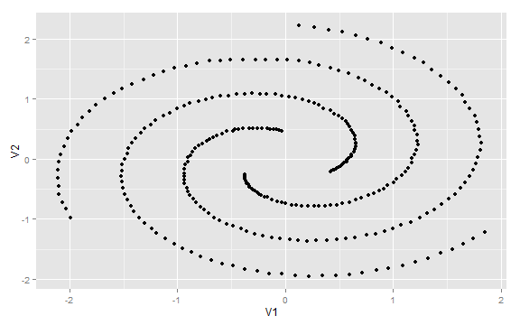
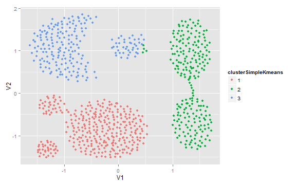
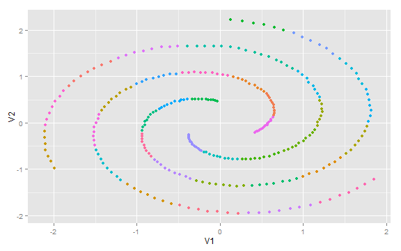
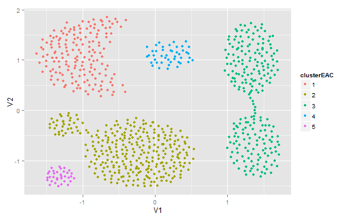
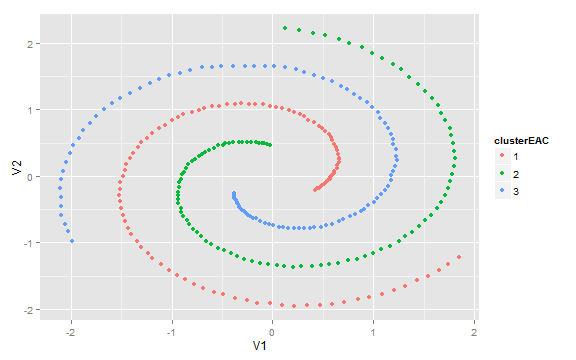
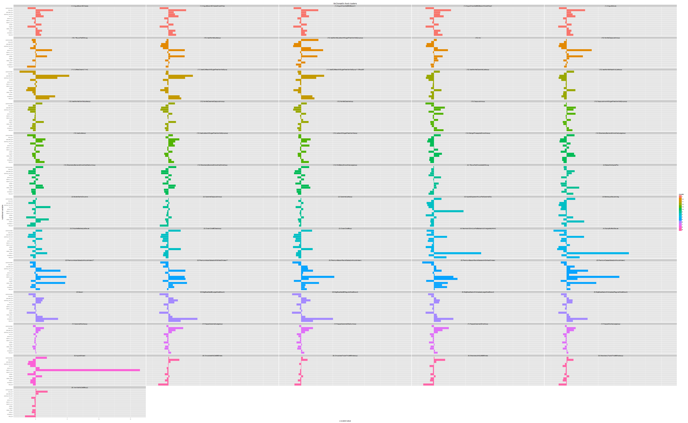

The Wisdom of Crowds - Clustering Using Evidence Accumulation Clustering (EAC)
=========================================================================

Textblock 1


```r
require(ggplot2)
require(cluster)
require(reshape)

# Dataset 1 - Aggregation dataset (http://cs.joensuu.fi/sipu/datasets/)
dataAggregatione <- read.csv("DATA/Aggregation.txt", sep = "\t", header = FALSE)
dataAggregationeScaled <- scale(dataAggregatione[, -3])  # normalize data
dataAggregatione <- data.frame(dataAggregationeScaled, name = as.character(c(1:nrow(dataAggregationeScaled))))
rownames(dataAggregatione) <- dataAggregatione$name
ggplot(dataAggregatione, aes(V1, V2)) + geom_point()
```

 

```r

# Dataset 2 - Spiral dataset (http://cs.joensuu.fi/sipu/datasets/)
dataSpiral <- read.csv("DATA/spiral.txt", sep = "\t", header = FALSE)
dataSpiralScaled <- scale(dataSpiral[, -3])  # normalize data
dataSpiral <- data.frame(dataSpiralScaled, name = as.character(c(1:nrow(dataSpiralScaled))))
rownames(dataSpiral) <- dataSpiral$name
ggplot(dataSpiral, aes(V1, V2)) + geom_point()
```

 

```r

# Dataset 3 - the mcdonalds menu
# (https://github.com/echen/dirichlet-process)
dataMC <- read.csv("DATA/mcdonalds-normalized-data.tsv")
dataMC$total_fat <- as.numeric(dataMC$total_fat)
numericAttr <- c("total_fat", "cholesterol", "sodium", "dietary_fiber", "sugars", 
    "protein", "vitamin_a_dv", "vitamin_c_dv", "calcium_dv", "iron_dv", "calories_from_fat", 
    "saturated_fat", "trans_fat", "carbohydrates")
dataMC <- na.omit(dataMC)  # drop NAs
dataMCScaled <- scale(dataMC[, -ncol(dataMC)])  # normalize data
dataMC <- data.frame(dataMCScaled, name = dataMC$name)
```


Textblock 2


```r
# ------------------------------- Application of k-means
# -------------------------------
require(clusterCrit)

set.seed(1234)
vals <- matrix(rep(NA, 49 * 3), ncol = 3, dimnames = list(c(), c("Dunn", "Calinski-Harabasz", 
    "Silhouette")))  # matrix to hold the score value
for (k in 2:50) {
    cl <- kmeans(dataAggregatione[, c(1, 2)], k)
    vals[(k - 1), 1] <- as.numeric(intCriteria(as.matrix(dataAggregatione[, 
        c(1, 2)]), cl$cluster, "Dunn"))
    vals[(k - 1), 2] <- as.numeric(intCriteria(as.matrix(dataAggregatione[, 
        c(1, 2)]), cl$cluster, "Calinski_Harabasz"))
    vals[(k - 1), 3] <- as.numeric(intCriteria(as.matrix(dataAggregatione[, 
        c(1, 2)]), cl$cluster, "Silhouette"))
}
vals <- data.frame(K = c(2:50), vals)
vals[bestCriterion(vals[, 2], "Dunn"), "K"]
vals[bestCriterion(vals[, 3], "Calinski_Harabasz"), "K"]
vals[bestCriterion(vals[, 4], "Silhouette"), "K"]

set.seed(1234)
vals <- matrix(rep(NA, 49 * 3), ncol = 3, dimnames = list(c(), c("Dunn", "Calinski-Harabasz", 
    "Silhouette")))
for (k in 2:50) {
    cl <- kmeans(dataSpiral[, c(1, 2)], k)
    vals[(k - 1), 1] <- as.numeric(intCriteria(as.matrix(dataSpiral[, c(1, 2)]), 
        cl$cluster, "Dunn"))
    vals[(k - 1), 2] <- as.numeric(intCriteria(as.matrix(dataSpiral[, c(1, 2)]), 
        cl$cluster, "Calinski_Harabasz"))
    vals[(k - 1), 3] <- as.numeric(intCriteria(as.matrix(dataSpiral[, c(1, 2)]), 
        cl$cluster, "Silhouette"))
}
vals <- data.frame(K = c(2:50), vals)
vals[bestCriterion(vals[, 2], "Dunn"), "K"]
vals[bestCriterion(vals[, 3], "Calinski_Harabasz"), "K"]
vals[bestCriterion(vals[, 4], "Silhouette"), "K"]
```


Textblock 3


```r
# ------------------------------- Plot results
# ------------------------------- Aggregation dataset
kmeansResultsAggreation <- kmeans(x = dataAggregatione[, c(1, 2)], centers = 3)$cluster
dataAggregatione$clusterSimpleKmeans <- as.character(kmeansResultsAggreation)
ggplot(dataAggregatione, aes(V1, V2)) + geom_point(aes(colour = clusterSimpleKmeans))
```

 

```r

# Spiral dataset
kmeansResultsSpiral <- kmeans(x = dataSpiral[, c(1, 2)], centers = 37)$cluster
dataSpiral$clusterSimpleKmeans <- as.character(kmeansResultsSpiral)
ggplot(dataSpiral, aes(V1, V2)) + geom_point(aes(colour = clusterSimpleKmeans)) + 
    opts(legend.position = "none")
```

 


Textblock 4


```r
# ------------------------------- Evidence Accumulation Clustering
# -------------------------------
createCoAssocMatrix <- function(Iter, rangeK, dataSet) {
    nV <- dim(dataSet)[1]
    CoAssoc <- matrix(rep(0, nV * nV), nrow = nV)
    
    for (j in 1:Iter) {
        jK <- sample(c(rangeK[1]:rangeK[2]), 1, replace = FALSE)
        jSpecCl <- kmeans(x = dataSet, centers = jK)$cluster
        CoAssoc_j <- matrix(rep(0, nV * nV), nrow = nV)
        for (i in unique(jSpecCl)) {
            indVenues <- which(jSpecCl == i)
            CoAssoc_j[indVenues, indVenues] <- CoAssoc_j[indVenues, indVenues] + 
                (1/Iter)
        }
        CoAssoc <- CoAssoc + CoAssoc_j
    }
    return(CoAssoc)
}

eac <- function(Iter, rangeK, dataset, hcMethod = "single") {
    CoAssocSim <- createCoAssocMatrix(Iter, rangeK, dataset)
    
    CoAssocDist <- 1 - CoAssocSim  # transform from similiarity into distance matrix
    hclustM <- hclust(as.dist(CoAssocDist), method = hcMethod)
    cutValue <- hclustM$height[which.max(diff(hclustM$height))]  # determine the cut
    return(cutree(hclustM, h = cutValue))
}
```


Textblock 5


```r
# ------------------------------- Application of EAC
# -------------------------------

# Aggregation dataset
set.seed(1234)
EACResults_Aggregatione <- eac(Iter = 200, rangeK = c(2, 50), dataset = dataAggregatione[, 
    c(1, 2)], hcMethod = "single")
table(EACResults_Aggregatione)
```

```
## EACResults_Aggregatione
##   1   2   3   4   5 
## 170 307 232  45  34
```

```r
dataAggregatione$clusterEAC <- as.character(EACResults_Aggregatione)
ggplot(dataAggregatione, aes(V1, V2)) + geom_point(aes(colour = clusterEAC))
```

 

```r

# Spiral dataset
set.seed(1234)
EACResults_Spiral <- eac(Iter = 200, rangeK = c(2, 50), dataset = dataSpiral[, 
    c(1, 2)], hcMethod = "single")
table(EACResults_Spiral)
```

```
## EACResults_Spiral
##   1   2   3 
## 106 101 105
```

```r
dataSpiral$clusterEAC <- as.character(EACResults_Spiral)
ggplot(dataSpiral, aes(V1, V2)) + geom_point(aes(colour = clusterEAC))
```

 


Textblock 6


```r
# ------------------------------- Clustering the McDonalds menue
# -------------------------------
set.seed(1234)
EACResults_MC <- eac(Iter = 1000, rangeK = c(2, 50), dataset = dataMC[, numericAttr], 
    hcMethod = "single")
table(EACResults_MC)
```

```
## EACResults_MC
##   1   2   3   4   5   6   7   8   9  10  11  12  13  14 
##  19 126  39   2   9  15  16   1  21  20   4  27  18   8
```

```r
dataMC$cluster <- as.character(EACResults_MC)

# the following code snippet is taken from
# http://blog.echen.me/2012/03/20/infinite-mixture-models-with-nonparametric-bayes-and-the-dirichlet-process/
x = ddply(dataMC, .(name), function(df) head(df, 1))  # ignore duplicate food items.
x = ddply(x, .(cluster), function(df) head(df, 5))  # for each cluster, take at most 5 items (to avoid the plot being dominated by large clusters).
x$name = factor(x$name, levels = x$name[order(x$cluster)], ordered = T)  # Reorder names by cluster (so we can get a plot where all points in a cluster are together).
m = melt(x, id = c("name", "cluster"))  # Turn this into a tall-thin matrix.

m$name <- paste("(", m$cluster, ") ", m$name, sep = "")
qplot(variable, weight = value, data = m, color = cluster, fill = cluster, geom = "bar", 
    xlab = "Nutritional variable", ylab = "z-scaled value", main = "McDonald's Food Clusters") + 
    facet_wrap(~name, ncol = 5) + coord_flip() + scale_colour_hue("cluster") + 
    opts(axis.text.y = theme_text(size = 5), axis.text.x = theme_text(size = 5)) + 
    scale_fill_hue("cluster")
```

 

