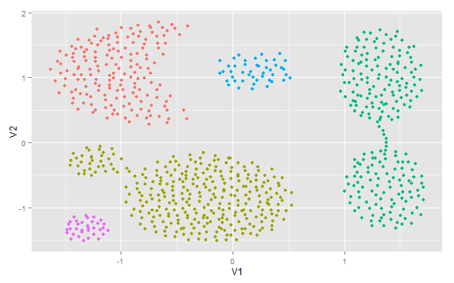
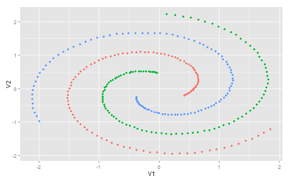

The Wisdom of Crowds - Clustering Using Evidence Accumulation Clustering (EAC)
=========================================================================

Today’s blog post is about a problem known by most of the people using cluster algorithms on datasets without given true labels (unsupervised learning). The challenge here is the “freedom of choice” over a broad range of different cluster algorithms and how to determine the right parameter values.  The difficulty is the following: Every clustering algorithm and even any set of parameters will produce a somewhat different solution. This makes it hard to decide, which of the results should be kept. Because there is no reference when using clustering in an unsupervised fashion, the analyst has to decide whether the results describe some causal or artificial patterns. I will present a method, which tackles the described problem and is also very simple to apply. I think that this makes it really interesting for a lot of practical problems and time-bounded projects. Like for most of the data analytics problems, the rule *[“There is No Free Lunch for the Data Miner”](http://khabaza.codimension.net/index_files/9laws.htm)* is still valid and hence also the limitations of the approach will be discussed.
For exemplification I used three datasets: The first two are artificial datasets and their purpose is to demonstrate the benefits and the limitations from the presented method. This will be done by contrasting the results with those from “classical methods”. For this we use the datasets named “Aggregation” (1) and “Spiral” (2). You can download them from [http://cs.joensuu.fi/sipu/datasets/](http://cs.joensuu.fi/sipu/datasets/) together with some information about the true number of partitions. The third dataset is about clustering the McDonalds menu and has more of a “real world character”. The partitions will consist of products featuring the same nutrition profile. You can find a different clustering with the same dataset at [this blog post](http://blog.echen.me/2012/03/20/infinite-mixture-models-with-nonparametric-bayes-and-the-dirichlet-process/) from Edwin Chen, where also the [dataset](https://github.com/echen/dirichlet-process) was originally from. At the end it would be interesting to compare our result with those presented by the mentioned blog.

Our first step is to load all three datasets and to do some data preprocessing (standardizing the features and omitting all tuples containing NA’s). The plots for dataset 1 and 2 show some typical shapes creating real challenges for most cluster algorithms.

```r
require(ggplot2)
require(cluster)
require(reshape)

# Dataset 1 - Aggregation dataset (http://cs.joensuu.fi/sipu/datasets/)
dataAggregatione <- read.csv("DATA/Aggregation.txt", sep = "\t", header = FALSE)
dataAggregationeScaled <- scale(dataAggregatione[, -3])  # normalize data
dataAggregatione <- data.frame(dataAggregationeScaled, name = as.character(c(1:nrow(dataAggregationeScaled))))
rownames(dataAggregatione) <- dataAggregatione$name
ggplot(dataAggregatione, aes(V1, V2)) + geom_point()
```

 

```r

# Dataset 2 - Spiral dataset (http://cs.joensuu.fi/sipu/datasets/)
dataSpiral <- read.csv("DATA/spiral.txt", sep = "\t", header = FALSE)
dataSpiralScaled <- scale(dataSpiral[, -3])  # normalize data
dataSpiral <- data.frame(dataSpiralScaled, name = as.character(c(1:nrow(dataSpiralScaled))))
rownames(dataSpiral) <- dataSpiral$name
ggplot(dataSpiral, aes(V1, V2)) + geom_point()
```

 

```r

# Dataset 3 - the mcdonalds menu
# (https://github.com/echen/dirichlet-process)
dataMC <- read.csv("DATA/mcdonalds-normalized-data.tsv")
dataMC$total_fat <- as.numeric(dataMC$total_fat)
numericAttr <- c("total_fat", "cholesterol", "sodium", "dietary_fiber", "sugars", 
    "protein", "vitamin_a_dv", "vitamin_c_dv", "calcium_dv", "iron_dv", "calories_from_fat", 
    "saturated_fat", "trans_fat", "carbohydrates")
dataMC <- na.omit(dataMC)  # drop NAs
dataMCScaled <- scale(dataMC[, -ncol(dataMC)])  # normalize data
dataMC <- data.frame(dataMCScaled, name = dataMC$name)
```


Now, let’s start with the analytical part by describing a typical challenge occurring in clustering. Most of the algorithms require some parameter $k$ which is used to determine the number of partitions produced by the clustering algorithm (e.g. [k-means](http://en.wikipedia.org/wiki/K-means_clustering), [spectral clustering](http://en.wikipedia.org/wiki/Spectral_clustering)). But it is inherent in the nature of the problem, that k cannot be specified a priori. This is because in unsupervised clustering the true number of partitions is not known prior. An approach to coop with that problem could be to use some relative validation criteria. The logic behind this is the following: The user computes a score over partitions resulting from different parameterizations where the score expresses the quality of a partition. At the end, the partition with the highest score should be kept as final result (It depends on the meaning of the score if it should be minimized or maximized. But for simplicity I assume that every score could be expressed as such that a high value is associated with a high clustering quality). 
The package *‘clusterCrit’* contains most relevant cluster validity indices coming from a broad range of research literature (e.g. [“On the Comparison of Relative Clustering Validity Criteria”, Vendramin et al.](https://www.siam.org/proceedings/datamining/2009/dm09_067_vendraminl.pdf)). In our first experiment I will use the [“Dunn-Index”](http://en.wikipedia.org/wiki/Dunn_index), the [“Calinski-Harabasz-Index”](https://www.siam.org/proceedings/datamining/2009/dm09_067_vendraminl.pdf) and the popular [Silhouette measure](http://en.wikipedia.org/wiki/Silhouette_(clustering)) together with the k-means algorithm on the two synthetic datasets. To account for the uncertainty about the right value of k, all possible values between 2 and 50 will be evaluated:

```r
# ------------------------------- Application of k-means
# -------------------------------
require(clusterCrit)

# Aggregation dataset
set.seed(1234)
vals <- matrix(rep(NA, 49 * 3), ncol = 3, dimnames = list(c(), c("Dunn", "Calinski-Harabasz", 
    "Silhouette")))  # matrix to hold the score value
for (k in 2:50) {
    cl <- kmeans(dataAggregatione[, c(1, 2)], k)
    vals[(k - 1), 1] <- as.numeric(intCriteria(as.matrix(dataAggregatione[, 
        c(1, 2)]), cl$cluster, "Dunn"))
    vals[(k - 1), 2] <- as.numeric(intCriteria(as.matrix(dataAggregatione[, 
        c(1, 2)]), cl$cluster, "Calinski_Harabasz"))
    vals[(k - 1), 3] <- as.numeric(intCriteria(as.matrix(dataAggregatione[, 
        c(1, 2)]), cl$cluster, "Silhouette"))
}
vals <- data.frame(K = c(2:50), vals)
choosen_k <- matrix(c(vals[bestCriterion(vals[, 2], "Dunn"), "K"], vals[bestCriterion(vals[, 
    3], "Calinski_Harabasz"), "K"], vals[bestCriterion(vals[, 4], "Silhouette"), 
    "K"]), ncol = 3, dimnames = list(c("Aggregation"), c("Dunn", "Calinski_Harabasz", 
    "Silhouette")))
choosen_k
```

```
##             Dunn Calinski_Harabasz Silhouette
## Aggregation   46                45          4
```

```r

# Spiral dataset
set.seed(1234)
vals <- matrix(rep(NA, 49 * 3), ncol = 3, dimnames = list(c(), c("Dunn", "Calinski-Harabasz", 
    "Silhouette")))
for (k in 2:50) {
    cl <- kmeans(dataSpiral[, c(1, 2)], k)
    vals[(k - 1), 1] <- as.numeric(intCriteria(as.matrix(dataSpiral[, c(1, 2)]), 
        cl$cluster, "Dunn"))
    vals[(k - 1), 2] <- as.numeric(intCriteria(as.matrix(dataSpiral[, c(1, 2)]), 
        cl$cluster, "Calinski_Harabasz"))
    vals[(k - 1), 3] <- as.numeric(intCriteria(as.matrix(dataSpiral[, c(1, 2)]), 
        cl$cluster, "Silhouette"))
}
vals <- data.frame(K = c(2:50), vals)
choosen_k <- matrix(c(vals[bestCriterion(vals[, 2], "Dunn"), "K"], vals[bestCriterion(vals[, 
    3], "Calinski_Harabasz"), "K"], vals[bestCriterion(vals[, 4], "Silhouette"), 
    "K"]), ncol = 3, dimnames = list(c("Spiral"), c("Dunn", "Calinski_Harabasz", 
    "Silhouette")))
choosen_k
```

```
##        Dunn Calinski_Harabasz Silhouette
## Spiral   34                50         37
```


Hence the first surprise is how distinct some of the validity scores are for both datasets. Even though the special structure of the data is challenging for the k-means algorithm, the results indicates that the choice of the right validation criteria is non-trivial, difficult and shows significant impact on the results. If we plot the resulting clustering for the best value obtained with the Silhouette score, the figures show that the approach failed for both datasets, even in picturing the coarse structure:

```r
# ------------------------------- Plot results
# ------------------------------- Aggregation dataset
kmeansResultsAggreation <- kmeans(x = dataAggregatione[, c(1, 2)], centers = 3)$cluster
dataAggregatione$clusterSimpleKmeans <- as.character(kmeansResultsAggreation)
ggplot(dataAggregatione, aes(V1, V2)) + geom_point(aes(colour = clusterSimpleKmeans)) + 
    opts(legend.position = "none")
```

 

```r

# Spiral dataset
kmeansResultsSpiral <- kmeans(x = dataSpiral[, c(1, 2)], centers = 37)$cluster
dataSpiral$clusterSimpleKmeans <- as.character(kmeansResultsSpiral)
ggplot(dataSpiral, aes(V1, V2)) + geom_point(aes(colour = clusterSimpleKmeans)) + 
    opts(legend.position = "none")
```

 


Now, let me introduce a method which overcomes the problem of choosing the right k value and which gives better result even when a simple clustering algorithm like k-means is used. It is called “Evidence Accumulation Clustering” and you can find some more deep information [here](http://www.cs.msu.edu/prip/ResearchProjects/cluster_research/papers/AFred_AJain_ICPR2002.pdf) and [here](http://web.cse.msu.edu/prip/Files/AFred_AJain_SSPR2002.pdf). The notion behind this method is to build partitions with different algorithms and parameterizations and to aggregate all solutions into one final partition using every single partition as a voting if instances should be placed together. Hence if two venues will be placed together in most solutions, it is reasonable to assign them to the same cluster in the final partition. In this context, this method could also be understood as a tool to enhance the validity of the resulting partition by reducing the impact of a single non-optimal clustering. The algorithmic part is simple: The first part is about the creation of different partitions and aggregating the “votes”. For this we do two steps in each iteration: First, we cluster all data points with k-means using a randomly sampled value from a given interval for $k$. Second, we note if two instances ($i$ and $j$) are placed together inside of one cluster. In this case we increment the corresponding entry ($A(i,j)$ and $A(j,i)$) in our so called association matrix $A$ by 1. At the end of the first part we divide all entries by R, the number of iterations. In the second part the “votes” are aggregated through hierarchical clustering and we obtain our final partition by selecting an appropriate cutting point in the resulting dendogram. For this we transform the association matrix $A$ from the first part into a distance matrix and feed it into a single linkage clustering. On the resulting dendogram we calculate the so called “maximal cluster livetime”. It is the longest ‘gap’ between two successive merges. Using this as our cutting point we obtain a final partition. The code below is some technically simple draft of this algorithm (e.g. no parallelization):

```r
# ------------------------------- Evidence Accumulation Clustering
# -------------------------------
createCoAssocMatrix <- function(Iter, rangeK, dataSet) {
    nV <- dim(dataSet)[1]
    CoAssoc <- matrix(rep(0, nV * nV), nrow = nV)
    
    for (j in 1:Iter) {
        jK <- sample(c(rangeK[1]:rangeK[2]), 1, replace = FALSE)
        jSpecCl <- kmeans(x = dataSet, centers = jK)$cluster
        CoAssoc_j <- matrix(rep(0, nV * nV), nrow = nV)
        for (i in unique(jSpecCl)) {
            indVenues <- which(jSpecCl == i)
            CoAssoc_j[indVenues, indVenues] <- CoAssoc_j[indVenues, indVenues] + 
                (1/Iter)
        }
        CoAssoc <- CoAssoc + CoAssoc_j
    }
    return(CoAssoc)
}

eac <- function(Iter, rangeK, dataset, hcMethod = "single") {
    CoAssocSim <- createCoAssocMatrix(Iter, rangeK, dataset)
    
    CoAssocDist <- 1 - CoAssocSim  # transform from similiarity into distance matrix
    hclustM <- hclust(as.dist(CoAssocDist), method = hcMethod)
    cutValue <- hclustM$height[which.max(diff(hclustM$height))]  # determine the cut
    return(cutree(hclustM, h = cutValue))
}
```


Now let’s try this method on both artificial datasets using exactly the same set of possible values for k like in the first case above:

```r
# ------------------------------- Application of EAC
# -------------------------------

# # Aggregation dataset
set.seed(1234)
EACResults_Aggregatione <- eac(Iter = 200, rangeK = c(2, 50), dataset = dataAggregatione[, 
    c(1, 2)], hcMethod = "single")
table(EACResults_Aggregatione)
```

```
## EACResults_Aggregatione
##   1   2   3   4   5 
## 170 307 232  45  34
```

```r
dataAggregatione$clusterEAC <- as.character(EACResults_Aggregatione)
ggplot(dataAggregatione, aes(V1, V2)) + geom_point(aes(colour = clusterEAC)) + 
    opts(legend.position = "none")
```

 

```r

# Spiral dataset
set.seed(1234)
EACResults_Spiral <- eac(Iter = 200, rangeK = c(2, 50), dataset = dataSpiral[, 
    c(1, 2)], hcMethod = "single")
table(EACResults_Spiral)
```

```
## EACResults_Spiral
##   1   2   3 
## 106 101 105
```

```r
dataSpiral$clusterEAC <- as.character(EACResults_Spiral)
ggplot(dataSpiral, aes(V1, V2)) + geom_point(aes(colour = clusterEAC)) + opts(legend.position = "none")
```

 


The new results clearly show a real progress even when the algorithm slightly underestimates the true number of clusters for the Aggregation dataset (7). But as the discussion in the mentioned paper on EAC depicts, the algorithm has some problems with not so well separated clusters – nobody is perfect. The results using the Spiral dataset look flawless. All three clusters are identified even though we use a simple k-means algorithm with moderate overhead for building the EAC algorithm.
Let’s close this post with an application of the described method on the mentioned McDonalds dataset. The preprocessing of the data and the plotting is taken from the code published by Edwin Chen.

```r
# ------------------------------- Clustering the McDonalds menue
# -------------------------------
set.seed(1234)
EACResults_MC <- eac(Iter = 1000, rangeK = c(2, 50), dataset = dataMC[, numericAttr], 
    hcMethod = "single")
table(EACResults_MC)
```

```
## EACResults_MC
##   1   2   3   4   5   6   7   8   9  10  11  12  13  14 
##  19 126  39   2   9  15  16   1  21  20   4  27  18   8
```

```r
dataMC$cluster <- as.character(EACResults_MC)

# the following code snippet is taken from
# http://blog.echen.me/2012/03/20/infinite-mixture-models-with-nonparametric-bayes-and-the-dirichlet-process/
x = ddply(dataMC, .(name), function(df) head(df, 1))  # ignore duplicate food items.
x = ddply(x, .(cluster), function(df) head(df, 5))  # for each cluster, take at most 5 items (to avoid the plot being dominated by large clusters).
x$name = factor(x$name, levels = x$name[order(x$cluster)], ordered = T)  # Reorder names by cluster (so we can get a plot where all points in a cluster are together).
m = melt(x, id = c("name", "cluster"))  # Turn this into a tall-thin matrix.

m$name <- paste("(", m$cluster, ") ", m$name, sep = "")
qplot(variable, weight = value, data = m, color = cluster, fill = cluster, geom = "bar", 
    width = 1, xlab = "nutritional variable", ylab = "z-scaled value", main = "McDonald's food clusters") + 
    facet_wrap(~name, ncol = 5) + coord_flip() + scale_colour_hue("cluster") + 
    opts(axis.text.y = theme_text(size = 8), axis.text.x = theme_text(size = 8)) + 
    scale_fill_hue("cluster")
```

 


Here EAC gives us 14 partitions, 3 more than Edwin Chen found. In this example, it is more difficult to verify the solution. Hence our validation is more a qualitative one. The final plot shows five instances at maximum per partition together with their nutrition profiles. A first look at our results indicates that most of the clusters exhibit a good separation (except cluster 2 which includes some more heterogeneous items). I will not discuss every cluster in detail but here are some specific remarks:
Cluster 3, 10, 12 and 14 show somehow similar profiles, nevertheless:
* cluster 12 (non-fat variants of coffee with syrup) is rich on carbohydrates and sugar
* cluster 10 (non-fat variants of coffee pure) has more protein and calcium
* cluster 3 is similar to cluster 12 but with less proteins and it contains more items with “extreme” profiles like apple dippers and 
* cluster 14 - consisting of fruit smoothies with a lot of dietary fiber and proteins

Maybe it would be more plausible to shift the apple dippers in cluster 8, which only contains the apple slices.

So what could finally be said about the presented method? Although it has some limitations it poses an interesting and simple method, which gives much better results than single runs with an algorithm like k-means. The shown algorithm could be extended as well. One option could be to substitute the base method with a more sophisticated method. Another idea is to use a form of weighted aggregation of the partitions - mentioned [here](http://ieeexplore.ieee.org/xpl/login.jsp?tp=&arnumber=4145946&url=http%3A%2F%2Fieeexplore.ieee.org%2Fiel5%2F4145898%2F4099323%2F04145946.pdf%3Farnumber%3D4145946).

Like always, any helpful comment or idea is welcome.
