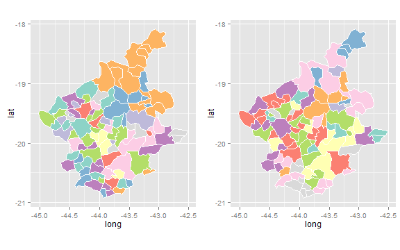
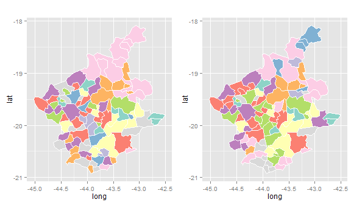

Matching clustering solutions using the 'Hungarian method'
========================================================

Some time ago I stumbled upon a problem connected with the labels of a clustering. The partition an instance belongs to, is  mostly labeled through an integer ranging from 1 to K, where k is the number of clusters. The task at that time was to plot a map of the results from the clustering of spatial polygons where every cluster is represented by some color. Like in most projects the analysis was performed multiple times and we used plotting to monitor the changes resulting from the iterations. But after rerunning the clustering algorithm (k-means in this case) the assignment between the clusters and the labeling completely changed, even when using the same parameters. This is because there is no unique connection between a partition (a group of elements) and a specific label (eg. "1"). So even when two solutions match perfectly the assigned labels changed completely. So the graphical representations of two clusterings (which only have some slight differences) look like they are completely different. This is because the coloring relates to the labels. The following R code depicts a simple example for this matter:

```r
require(spdep)
require(rgdal)
require(maptools)
require(ggplot2)
require(plyr)
library(grid)

vplayout <- function(x, y) viewport(layout.pos.row = x, layout.pos.col = y)  # panel function for the plots

gpclibPermit()  # required for fortify method (see https://github.com/hadley/ggplot2/wiki/plotting-polygon-shapefiles)
```


```r
bh <- readShapePoly(system.file("etc/shapes/bhicv.shp", package = "spdep")[1])

# prepare input data
bh@data$id = rownames(bh@data)
bh.points = fortify(bh, region = "id")
bh.df = join(bh.points, bh@data, by = "id")

# clustering after standardization of data
dpad <- data.frame(scale(bh@data[, 5:8]))
set.seed(1234)
res1 <- kmeans(dpad, centers = 10)
set.seed(9999)
res2 <- kmeans(dpad, centers = 10)

# add cluster id to polygon layer
bh.df.cl = merge(bh.df, data.frame(id = bh@data$id, CL1 = res1$cluster, CL2 = res2$cluster), 
    by = "id")

# plot
p1 <- ggplot(bh.df.cl) + aes(long, lat, group = group, fill = as.factor(CL1)) + 
    geom_polygon() + geom_path(color = "white") + coord_equal() + scale_fill_brewer(palette = "Set3") + 
    theme(plot.margin = unit(c(0.2, 0.2, 0.2, 0.2), "cm"), legend.position = "none")
p2 <- ggplot(bh.df.cl) + aes(long, lat, group = group, fill = as.factor(CL2)) + 
    geom_polygon() + geom_path(color = "white") + coord_equal() + scale_fill_brewer(palette = "Set3") + 
    theme(plot.margin = unit(c(0.2, 0.2, 0.2, 0.2), "cm"), legend.position = "none")
grid.newpage()
pushViewport(viewport(layout = grid.layout(1, 2)))
print(p1, vp = vplayout(1, 1))
print(p2, vp = vplayout(1, 2))
```

 


After searching the internet for a possible approach my first results point to the direction of methods for cluster validation (subsequently I found out that this problem is also evident when it comes to consensus clustering). In a research paper from Lange et. al. ["Stability-based validation of clustering solutions"](http://www.ml.inf.ethz.ch/publications/lange.neco_stab.03.pdf) the authors describe a sampling based approach for evaluating the stability of clustering solutions. Therefore they hade to compare partitions from different runs over the data. This matches exactly the same question I described above. Here a method from [Kuhn](http://mike.mccreavy.com/hungarian-assignment-problem.pdf) called the 'Hungarian method' for minimum weighted bipartite matching is mentioned which should solve the assignment of two different clustering solutions onto each other. As a result we could rearrange the labels from one clustering.

But what is the idea of formulating this correspondence problem as an optimization exercise? You can relate this type of question to weighted bipartite graphs and subsets of them. In a bipartite graph a matching is a subset of the edges so that no two edges in the subset share a common vertex. It is called a minimum weighted bipartite matching when the graph is a weighted bipartite graph and the sum of all edges in the subset is minimal. This could be represented as a distance matrix having the dimension of the number of clusters where the value between two instances depicts the agreement between these two partitions (one constraint for this approach is that there is the same number of partitions in both clusterings). So, one clustering is represented by columns and the other one by row or vice versa. The agreement can be calculated as follows: Calculate the number of elements in the intersection of the two partitions and subtract it twice from the sum of the number of elements in both clusters. The notion behind this computation is that if all elements are in the intersection, the value is zero and hence it is very likely that these two partitions are mapped on each other. The higher the value the more different are the two partitions. One approach for calculating this distance matrix in R looks like the following (herby we us the method *solve_LSAP* from the package [clue](http://cran.r-project.org/web/packages/clue/index.html), where some additional explanations could also be found inside the associated paper ["A CLUE for CLUster Ensembles"](http://www.jstatsoft.org/v14/i12/paper)):

```r
# labels from cluster A will be matched on the labels from cluster B
minWeightBipartiteMatching <- function(clusteringA, clusteringB) {
    require(clue)
    idsA <- unique(clusteringA)  # distinct cluster ids in a
    idsB <- unique(clusteringB)  # distinct cluster ids in b
    nA <- length(clusteringA)  # number of instances in a
    nB <- length(clusteringB)  # number of instances in b
    if (length(idsA) != length(idsB) || nA != nB) {
        stop("number of cluster or number of instances do not match")
    }
    
    nC <- length(idsA)
    tupel <- c(1:nA)
    
    # computing the distance matrix
    assignmentMatrix <- matrix(rep(-1, nC * nC), nrow = nC)
    for (i in 1:nC) {
        tupelClusterI <- tupel[clusteringA == i]
        solRowI <- sapply(1:nC, function(i, clusterIDsB, tupelA_I) {
            nA_I <- length(tupelA_I)  # number of elements in cluster I
            tupelB_I <- tupel[clusterIDsB == i]
            nB_I <- length(tupelB_I)
            nTupelIntersect <- length(intersect(tupelA_I, tupelB_I))
            return((nA_I - nTupelIntersect) + (nB_I - nTupelIntersect))
        }, clusteringB, tupelClusterI)
        assignmentMatrix[i, ] <- solRowI
    }
    
    # optimization
    result <- solve_LSAP(assignmentMatrix, maximum = FALSE)
    attr(result, "assignmentMatrix") <- assignmentMatrix
    return(result)
}
```

A simple example will illustrate the matching:

```r
minWeightBipartiteMatching(c(1, 1, 2, 3, 3, 4, 4, 4, 2), c(2, 2, 3, 1, 1, 4, 
    4, 4, 3))
```

```
## Optimal assignment:
## 1 => 2, 2 => 3, 3 => 1, 4 => 4
```

The mapping resulting for the example should be done in the following way: rename cluster 1 from the first partition as 2, cluster 2 as 3, cluster 3 as 1 and cluster 4 keeps its name.  
The last step is to write some code to carry out the mapping automatically. 

```r
matching <- minWeightBipartiteMatching(res1$cluster, res2$cluster)
clusterA <- res1$cluster  # map the labels from cluster A
tmp <- sapply(1:length(matching), function(i) {
    clusterA[which(res1$cluster == i)] <<- matching[i]
})

clusterB <- res2$cluster
bh.df.cl.mwbm = merge(bh.df, data.frame(id = bh@data$id, CL1 = clusterA, CL2 = clusterB), 
    by = "id")

# plot
p1 <- ggplot(bh.df.cl.mwbm) + aes(long, lat, group = group, fill = as.factor(CL1)) + 
    geom_polygon() + geom_path(color = "white") + coord_equal() + scale_fill_brewer(palette = "Set3") + 
    theme(plot.margin = unit(c(0.2, 0.2, 0.2, 0.2), "cm"), legend.position = "none")
p2 <- ggplot(bh.df.cl.mwbm) + aes(long, lat, group = group, fill = as.factor(CL2)) + 
    geom_polygon() + geom_path(color = "white") + coord_equal() + scale_fill_brewer(palette = "Set3") + 
    theme(plot.margin = unit(c(0.2, 0.2, 0.2, 0.2), "cm"), legend.position = "none")
grid.newpage()
pushViewport(viewport(layout = grid.layout(1, 2)))
print(p1, vp = vplayout(1, 1))
print(p2, vp = vplayout(1, 2))
```

 

Looking at the final plot reveals, that besides the inherent instability from the k-mean method the clustering looks approximately identical and thus the mapping was done successfully.
Hoping that this code will also help others, I'm looking forward for any helpful comment.
