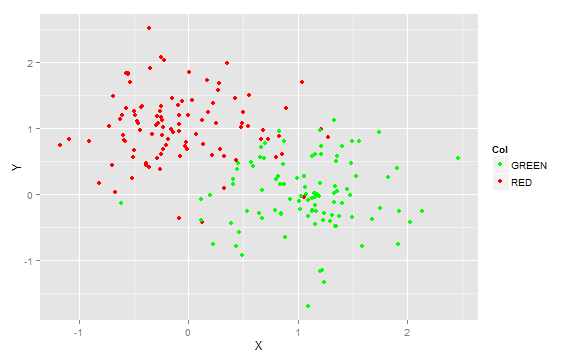
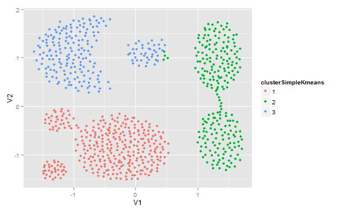
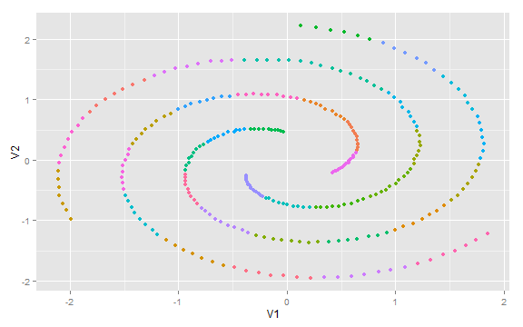

Predictive Modeling using R and the OpenScoring-Engine – a PMML approach
========================================================

On November, the 27^th, a special [post](http://scottmutchler.blogspot.de/2012/11/openscoring-open-source-scoring-of-pmml.html) took my interest. Scott Mutchler presented a small framework for predictive analytics based on the [PMML](http://www.dmg.org/v4-1/GeneralStructure.html) (Predictive Model Markup Language) and a Java-based REST-Interface. PMML is a XML based standard for the description and exchange of analytical models. The idea is that every piece of software which supports the corresponding PMML (newest version 4.1) version could utilize such a model description to predict outcomes regardless of the creation process. Using PMML offers some big advantages especially when using R for modeling with the final task to bring a model into production afterwards. Often the IT-staff is not willing to support yet another piece of software beside the legacy systems, particularly when there are no service agreements, 24/7 support or guaranteed ‘High Availability’. Also an analytical workflow, in which you can send your model right into production is one of the key points most commercial software vendors in the field of analytical software mention (e.g. [Revolution Enterprise](http://www.revolutionanalytics.com/products/revolution-enterprise.php), [TIBCO Spotfire](http://spotfire.tibco.com/), …). Scott Mutchler’s OpenScoring is a first draft for such a prediction engine and definitely worth to have an eye on it. While he created mainly the server side of the engine, my intention was to create some simple sketch for the client side, so that you can call the servlet engine from within R. Therefore two main functions have to be provided:

1. Exporting a predictive model into XML
2. Predicting a target variable, given a dataset and a model (specified in PMML)

So the first step was to get the engine running. I experienced some small problems but Scott fixed them very fast and offered a new war file ready for deployment inside tomcat. It can be obtained under [http://code.google.com/p/openscoring/](http://code.google.com/p/openscoring/). If you still encounter some problems you could also try [my war file](http://dl.dropbox.com/u/45974911/OpenScoring.war). It was built with java version "1.6.0_26" and tested under [tomcat 7](http://tomcat.apache.org/download-70.cgi). After installing the war file using the management console, you could test it by sending a POST request in XML like the following to ‘[http://localhost:8080/OpenScoring/Scoring](http://localhost:8080/OpenScoring/Scoring)’:
```
<?xml version="1.0" encoding="UTF-8"?>
<scoring_request>
  <pmml_url>http://www.dmg.org/pmml_examples/knime_pmml_examples/IrisNeuralNet.xml</pmml_url>
  <model_name></model_name>
  <csv_input_rows><![CDATA[sepal_length,sepal_width,petal_length,petal_width|5.1,3.5,1.4,0.2|7,3.2,4.7,1.4|6.3,2.9,5.6,1.8|]]>
  </csv_input_rows>
</scoring_request>
```
A nice tool for first experiments is the [poster plugin](https://addons.mozilla.org/en-us/firefox/addon/poster/) for Firefox.

Now let’s turn to developing the client side. The implementation of the first mentioned functionality is pretty straight forward – build your model in the classical way and export it using the [PMML](http://cran.r-project.org/web/packages/pmml/index.html) package. You can find the supported methods inside PMMLs documentation or [here](http://rattle.togaware.com/pmml.html). The following code shows a small example using decision trees and artificial data consisting only of numerical attributes (including target):

```r
require(ggplot2)  # for visualization
require(pmml)  # for storing the model in xml
require(rpart)  # use decision trees

# ------------------------------------------------------- Example 1 -
# categorical target with numeric inputs
# -------------------------------------------------------

# create artificial dataset
set.seed(1234)
gX <- rnorm(100, mean = 0, sd = 0.5)
gY <- rnorm(100, mean = 1, sd = 0.5)
rX <- rnorm(100, mean = 1, sd = 0.5)
rY <- rnorm(100, mean = 0, sd = 0.5)
dataset <- data.frame(X = c(gX, rX), Y = c(gY, rY), Col = c(rep("red", 100), 
    rep("green", 100)))

bp <- ggplot(dataset, aes(X, Y, colour = Col)) + geom_point()
bp + scale_colour_manual(name = "Col", values = c("green", "red"), labels = c("GREEN", 
    "RED"), breaks = c("green", "red"))
```

 

```r

# create decision tree model
treeModel <- rpart(Col ~ ., data = dataset)

# export as pmml
localFilenameAndPath = "/tmp/treeModel_numericalInput_categTarget.xml"  # place to store the xml file
saveXML(pmml(treeModel, model.name = "TreeModel", app.name = "RR/PMML", dataset = dataset), 
    file = localFilenameAndPath)  # save model using pmml
```

Most effort goes into developing the predict function. We should first transform the input data frame and split it into strings where every string represents one row in the data frame (including the header as one string). The fields have to be comma delimited. After that, all strings are combined into one string separated by the pipe (‘|’) symbol. 
The second step is creating the XML structure consisting of at least the main (`<scoring_request>`) and two subordinated nodes (`<pmml_url>` and `<csv_input_rows>`). The node `<pmml_url>` includes the url with schema ‘http://’, ‘file://’ or ‘ftp://’ and points to the place of your model. The node `<csv_input_rows>` contains the data formatted like mentioned above, wrapped inside a *CDATA* node. Last but not least the whole XML document needs to be transformed into a string.
As a third we send the POST-Request to the server using *curlPerform* from the [RCurl](http://cran.r-project.org/web/packages/RCurl/index.html) package:
Last part will be to extract the results from the server response. The format is the same like in the request but it contains the predictions in one additional column. So using a combination of *strsplit*, *gsub* and *sapply* will get the job done. Because of that the prediction is always given as a character we need to convert it properly. Therefore the user has to specify a proper transformation function as input to the prediction function.

```r
predictPMMLModel <- function(dataset,   # dataset for prediction 
		transformTargetAttribute, 	  	# type of target attribute
		modelURL, 						# place where the scoring engine could find the pmml model
		applServerURL					# servlet url
){
	require(XML)
	require(RCurl)
	
	header <- paste(colnames(dataset), collapse=",") # extract header
	# transformation to characters is necessary to avoid some “bad surprise” from R's handling of factor attributes
	datasetTransf <- data.frame(lapply(dataset, as.character), stringsAsFactors=FALSE)
	dataString <- paste(header,"|", paste(do.call("rbind",
							by(datasetTransf, 1:nrow(datasetTransf), function(row) {
										paste(row, collapse=",")
									}, simplify = FALSE)), collapse ="|"), "|", sep = "")
	
	# create xml document
	xmlHeader <- xmlPINode(sys = 'xml', value = 'version="1.0" encoding="UTF-8"')
	xmlRequest <- xmlNode("scoring_request", 
			xmlNode("pmml_url", modelURL), 
			xmlNode("model_name"),
			xmlNode("csv_input_rows",xmlCDataNode(dataString)))
	
	# xml request as string
	fullXMLRequest <- paste(toString(xmlHeader),"\n", gsub(" ", "", toString(xmlRequest, sep=""), fixed = TRUE))
	
	# http post request
	r = dynCurlReader()
	curlPerform(postfields = fullXMLRequest, url = applServerURL, 
			verbose = TRUE, post = 1L, writefunction = r$update)
	r$value()
	
	# parse results - !!caution: currently no error checking!!
	tmp <- xmlTreeParse(r$value())
	predictionString <- xmlValue(tmp[[1]][[1]][[4]])
	# extract predictions line by line
	predictionLines <- strsplit(predictionString, split ="|", fixed = TRUE)[[1]][-1]
	predictions <- transformTargetAttribute(sapply(predictionLines, function(s){
						gsub('\"','',tail(strsplit(s, ',', fixed = TRUE)[[1]], n=1))
					}))
	names(predictions) <- NULL
	return(predictions)
}
```

Calling the final prediction function then is straightforward and the given examples show some cases with different combinations of categorical/numeric input/target attributes. Simple results for the training error are also given:

```r
# prediction
prediction1 <- predictPMMLModel(dataset = dataset, transformTargetAttribute = factor, 
    modelURL = paste("file://", localFilenameAndPath, sep = ""), applServerURL = "http://localhost:10023/OpenScoring/Scoring")
table(dataset$Col, prediction1)  # tabulate results

# ------------------------------------------------------- Example 2 -
# categorical target with mixed inputs
# -------------------------------------------------------

# create artificial dataset
set.seed(1234)
gX <- factor(sample(c("a", "b", "c"), size = 100, replace = TRUE, prob = c(0.7, 
    0.2, 0.1)))
gY <- rnorm(100, mean = 1, sd = 0.5)
rX <- factor(sample(c("a", "b", "c"), size = 100, replace = TRUE, prob = c(0.1, 
    0.2, 0.7)))
rY <- rnorm(100, mean = 0, sd = 0.5)

# http://stackoverflow.com/questions/8229904/r-combining-two-factors
dataset2 <- data.frame(X = unlist(list(gX, rX)), Y = c(gY, rY), Col = c(rep("red", 
    100), rep("green", 100)))

bp <- ggplot(dataset2, aes(X, Y, colour = Col)) + geom_point()
bp + scale_colour_manual(name = "Col", values = c("green", "red"), labels = c("GREEN", 
    "RED"), breaks = c("green", "red"))
```

 

```r

# create decision tree model
treeModel <- rpart(Col ~ ., data = dataset2)

# export as pmml
localFilenameAndPath = "/tmp/treeModel_mixedInput_categTarget.xml"
saveXML(pmml(treeModel, model.name = "TreeModel", app.name = "RR/PMML", dataset = dataset2), 
    file = localFilenameAndPath)
# prediction
prediction2 <- predictPMMLModel(dataset = dataset2, transformTargetAttribute = factor, 
    modelURL = paste("file://", localFilenameAndPath, sep = ""), applServerURL = "http://localhost:10023/OpenScoring/Scoring")

table(dataset2$Col, prediction2)  # tabulate results

# ----------------------------------------------- Example 3 - numerical
# target with mixed input -----------------------------------------------

# create artificial dataset
set.seed(1234)
gX <- factor(sample(c("a", "b", "c"), size = 100, replace = TRUE, prob = c(0.7, 
    0.2, 0.1)))
gY <- rnorm(100, mean = 1, sd = 0.5)
rX <- factor(sample(c("a", "b", "c"), size = 100, replace = TRUE, prob = c(0.1, 
    0.2, 0.7)))
rY <- rnorm(100, mean = 0, sd = 0.5)

dataset <- data.frame(X = unlist(list(gX, rX)), Y = c(gY, rY), Col = c(rnorm(100, 
    mean = -5, sd = 1), rnorm(100, mean = 5, sd = 1)))

bp <- ggplot(dataset, aes(X, Y, colour = Col)) + geom_point()
bp
```

 

```r

# create decision tree model
treeModel <- rpart(Col ~ ., data = dataset)

# export model as pmml
localFilenameAndPath = "/tmp/treeModel_mixedInput_numTarget.xml"
saveXML(pmml(treeModel, model.name = "TreeModel", app.name = "RR/PMML", dataset = dataset), 
    file = localFilenameAndPath)
# prediction
prediction3 <- predictPMMLModel(dataset = dataset, transformTargetAttribute = as.numeric, 
    modelURL = paste("file://", localFilenameAndPath, sep = ""), applServerURL = "http://localhost:10023/OpenScoring/Scoring")

modelResults <- data.frame(Y = dataset$Col, Y_hat = prediction3)
cor(modelResults$Y, modelResults$Y_hat)^2  # computing r squared

# ----------------------------------------------- Example 4 - numerical
# target with numerical input
# -----------------------------------------------

# create first artificial dataset
set.seed(1234)
gX <- rnorm(100, mean = 0, sd = 0.5)
gY <- rnorm(100, mean = 1, sd = 0.5)
rX <- rnorm(100, mean = 1, sd = 0.5)
rY <- rnorm(100, mean = 0, sd = 0.5)
dataset <- data.frame(X = c(gX, rX), Y = c(gY, rY), Col = c(rnorm(100, mean = -5, 
    sd = 1), rnorm(100, mean = 5, sd = 1)))

bp <- ggplot(dataset, aes(X, Y, colour = Col)) + geom_point()
bp
```

 

```r

# create decision tree model
treeModel <- rpart(Col ~ ., data = dataset)

# export model as pmml
localFilenameAndPath = "/tmp/treeModel_numericalInput_numTarget.xml"
saveXML(pmml(treeModel, model.name = "TreeModel", app.name = "RR/PMML", dataset = dataset), 
    file = localFilenameAndPath)
# prediction
prediction4 <- predictPMMLModel(dataset = dataset, transformTargetAttribute = as.numeric, 
    modelURL = paste("file://", localFilenameAndPath, sep = ""), applServerURL = "http://localhost:10023/OpenScoring/Scoring")

modelResults <- data.frame(Y = dataset$Col, Y_hat = prediction4)
cor(modelResults$Y, modelResults$Y_hat)^2  # computing r squared
```

Finally, here are some thoughts about what has been build. We should begin with a contra-point, which is the fact that PMML (at the moment) restricts you to use some standard modeling techniques (depending on the PMML version and the implementation of the used software for modeling and prediction). I know some projects where this would be a serious concern. But on the other side I think that a lot of analytic questions will be fine with the offered portfolio of approaches – looking at my own projects it may be 50 to 70 percent. 
On the pro-side there are a lot more things to mention. First, even if restricted to some standard models, you could use the full power of R to build your model, to try experiments with it, to optimize and tweak it and to visualize the results. Second, developer and user no longer need to use the same kind of software – the server/client could be written in any language able to understand XML and PMML (only the server if the client is not used for modeling) and on how to communicate with web services. Third, like mentioned at the beginning of the post, you now could utilize “enterprise-proven” software (Tomcat) to run your model. This really is one of the points which matters in practice (“… thanks for your nice prototype, but we should now have to bring it to java/c#/… “). Although there are some limitation, I think there are even more positive aspects (e.g. Documentation, versioning of models) and I am really interested about any complementary and helpful comments.
