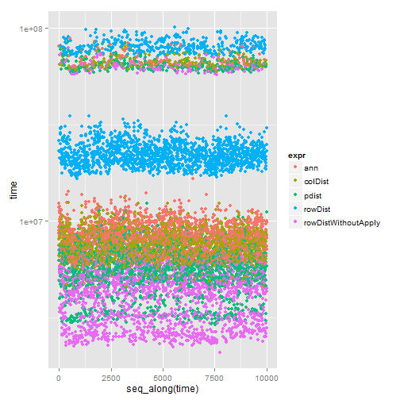

Benchmarking distance calculation in R
========================================================

A typical step in a lot of data mining methods is the calculation of a distance  between entities. For example using the [nearest-neighbor method](http://en.wikipedia.org/wiki/K-nearest_neighbor_algorithm) it is crucial to do this calculation very efficiently because it is the most time-consuming step of the procedure. Just imagine you want to compute the **Euclidean** distance between a constantly changing database and incoming queries - each one consits of exactly one entity.  Therefore you want to know how you can do the computation quick and easy. Bellow you see the output of some results using different packages and some self implemented approaches: 

First we have to create some artificial data which matches nicely to the structure of the data in one of my projects - that is where the question about distance calculation came from. Typically the database consists of 3000 entities with 55 features


```r
set.seed(1234)

# create some data
nFeature = 55
dataSet <- matrix(rnorm(3000 * nFeature), ncol = nFeature)
query <- matrix(rnorm(1 * nFeature), ncol = nFeature)

# parameter for distance calculations
K = 10  # number of nearest neighbors
```


The first package I stumbled upon was the [yaImpute](http://cran.r-project.org/web/packages/yaImpute/index.html) package - it contains the *ann* function which is based on the Approximate Nearest Neighbor Library (http://www.cs.umd.edu/~mount/ANN):

```r
library(yaImpute)

ann_dist <- function(ref, target, k) {
    res <- ann(ref = ref, target = target, tree.type = "kd", k = k, verbose = FALSE)
    return(res)
}
resANN <- ann_dist(ref = dataSet, target = query, k = K)
```


The second package is [pdist](http://cran.r-project.org/web/packages/pdist/index.html) including the function *pdist*:

```r
library(pdist)

pdist_wrapper <- function(ref, target, k) {
    distAll <- pdist(X = ref, Y = target)
    iNN <- order(distAll)[1:k]
    return(list(knnIndexDist = matrix(c(iNN, distAll[iNN]^2), nrow = 1), k = k))
    # similar to ann the element knnIndexDist from the list is a vector which
    # contains the indices of the nearest neighbors on position 1 to k and all
    # distances afterwards (position k+1 to 2k)
}
resPDIST <- pdist_wrapper(ref = dataSet, target = query, k = K)
```


The next approach subtracts the query from every entity in the database and sums up the distance (call it *rowDist*):

```r
rowDist <- function(ref, target, k) {
    distAll <- colSums(apply(ref, 1, "-", target)^2)
    iNN <- order(distAll)[1:k]
    return(list(knnIndexDist = matrix(c(iNN, distAll[iNN]), nrow = 1), k = k))
}
resRowDist <- rowDist(ref = dataSet, target = query, k = K)
```


And now the other way round - first you subtract every feature value from the corresponding feature vector of the database and second you sum up all parts of the overall distance (named *colDist*):

```r
colDist <- function(ref, target, k) {
    distAll <- rowSums(sapply(1:ncol(target), function(i) {
        (ref[, i] - target[, i])^2
    }))
    iNN <- order(distAll)[1:k]
    return(list(knnIndexDist = matrix(c(iNN, distAll[iNN]), nrow = 1), k = k))
}
resColDist <- colDist(ref = dataSet, target = query, k = K)
```


My last approach is similar to *rowDist* but avoids calling apply (call it *rowDistWithoutApply*):

```r
rowDistWithoutApply <- function(ref, target, k) {
    dists = colSums((t(ref) - target[1, ])^2)
    iNN = order(dists)[1:k]
    return(list(knnIndexDist = matrix(c(iNN, dists[iNN]), nrow = 1), k = k))
}
resRowDistWA <- rowDistWithoutApply(ref = dataSet, target = query, k = K)
```


So let's have a look at the results and check if all approaches give the same Nearest Neighbors and the correct results:

```r
matrix(cbind(A = t(resANN$knnIndexDist), t(resPDIST$knnIndexDist), t(resRowDist$knnIndexDist), 
    t(resColDist$knnIndexDist), t(resRowDistWA$knnIndexDist)), ncol = 5, dimnames = list(NULL, 
    c("ann", "pdist", "rowDist", "colDist", "rowDistWithoutApply")))
```

```
##           ann   pdist rowDist colDist rowDistWithoutApply
##  [1,]  526.00  526.00  526.00  526.00              526.00
##  [2,]  564.00  564.00  564.00  564.00              564.00
##  [3,] 2055.00 2055.00 2055.00 2055.00             2055.00
##  [4,]  402.00  402.00  402.00  402.00              402.00
##  [5,] 2703.00 2703.00 2703.00 2703.00             2703.00
##  [6,]  233.00  233.00  233.00  233.00              233.00
##  [7,]  274.00  274.00  274.00  274.00              274.00
##  [8,] 1749.00 1749.00 1749.00 1749.00             1749.00
##  [9,]  548.00  548.00  548.00  548.00              548.00
## [10,] 2358.00 2358.00 2358.00 2358.00             2358.00
## [11,]   57.50   57.50   57.50   57.50               57.50
## [12,]   58.10   58.10   58.10   58.10               58.10
## [13,]   59.72   59.72   59.72   59.72               59.72
## [14,]   60.27   60.27   60.27   60.27               60.27
## [15,]   61.33   61.33   61.33   61.33               61.33
## [16,]   62.47   62.47   62.47   62.47               62.47
## [17,]   62.49   62.49   62.49   62.49               62.49
## [18,]   63.07   63.07   63.07   63.07               63.07
## [19,]   63.10   63.10   63.10   63.10               63.10
## [20,]   63.18   63.18   63.18   63.18               63.18
```


Because there's no mismatch between the five approaches we will step into the final part - benchmarking. Here the results from the *ann* function will be also used as baseline because my goal is to replace this function with something simpler and faster.

First let's use the build in *system.time()* function to measure the time for 2000 repetitions:

```r
iterN <- 2000L
matrix(cbind(system.time(for (i in 1:iterN) {
    ann_dist(ref = dataSet, target = query, k = 50)
})[1:3], system.time(for (i in 1:iterN) {
    pdist_wrapper(ref = dataSet, target = query, k = 50)
})[1:3], system.time(for (i in 1:iterN) {
    rowDist(ref = dataSet, target = query, k = 50)
})[1:3], system.time(for (i in 1:iterN) {
    colDist(ref = dataSet, target = query, k = 50)
})[1:3], system.time(for (i in 1:iterN) {
    rowDistWithoutApply(ref = dataSet, target = query, k = 50)
})[1:3]), ncol = 5, dimnames = list(c("user", "system", "elapsed"), c("ann", 
    "pdist", "rowDist", "colDist", "rowDistWithoutApply")))
```

```
##           ann pdist rowDist colDist rowDistWithoutApply
## user    15.07 17.23   63.87   19.11                8.83
## system   1.99  2.79    2.88    1.10                1.96
## elapsed 17.05 20.03   66.92   20.21               10.85
```

Second, for a more precisely measurement I use the package [microbenchmark](http://cran.r-project.org/web/packages/microbenchmark/index.html) which uses some quite accurate timing functions

```r
library(microbenchmark)
res <- microbenchmark(ann = ann_dist(ref = dataSet, target = query, k = 50), 
    pdist = pdist_wrapper(ref = dataSet, target = query, k = 50), rowDist = rowDist(ref = dataSet, 
        target = query, k = 50), colDist = colDist(ref = dataSet, target = query, 
        k = 50), rowDistWithoutApply = rowDistWithoutApply(ref = dataSet, target = query, 
        k = 50), times = 2000L)
print(res)
```

```
## Unit: milliseconds
##                  expr    min     lq median     uq    max
## 1                 ann  5.836  7.095  8.279  9.553  88.08
## 2             colDist  4.400  6.746  7.656  8.859  81.09
## 3               pdist  2.828  5.035  5.867  7.259  84.60
## 4             rowDist 16.619 20.488 22.769 27.165 100.37
## 5 rowDistWithoutApply  2.097  3.202  4.435  5.360  78.61
```


Finally some nice plot is showing the results (there seems to be an interesting pattern, revealing that temporal "outliers" are building an individual cluster with much higher execution times than the average)

```r
library(ggplot2)
plt <- qplot(y = time, data = res, colour = expr)
plt <- plt + scale_y_log10()
print(plt)
```

 

So happily we found a better solution - *rowDistWithoutApply* - for calculating a distance between a dataset and a query which is approximately two times faster (of course we have to be careful because there is no error checking) and does not need an additional library. The second winner is *pdist* from the pdist package followed by *ann* and *colDist*. *rowDist* performs worst.
So for my case this outcome remains quite stable but it's interesting if this behavior is the general case or if there are any constraints. In this this sense any helpful comments are more than welcome.
